# 智能水务管理平台

## 介绍
智慧水务物联网系统是用户单位基于智能水表（包含但不限于NB-lot水表等智能表）、智能消火栓、智能阀门、数据采集终端（RTU或PLC）及其他前置传感器和设备在供水方面的应用管理系统，由这些设备采集到监测点的各种数据（诸如：输水管道、供水管道的压力、流量，二次蓄水池的水位、压力、流量、浊度、余氯、泵频等等信息），通过NB-lot、光缆、GPRS和WIFI等多种方式传输，交给后台管理系统进行分析、处理、显示、告警和返回控制等一系列操作，实现对供水管道的无人化、远程、实时的监测和控制，以解决用水单位对水源信息采集、泵房远程监控、管网水量的监控、各环节监测点的数据采集和监控报警，及时发现管网故障，准确快速响应源水污染及管网暴管应急处理等，提高维护效率，降低损失，保障输水、供水质量，达到科学预警，减少成本，提高效率的目的。
整体方案的目标是实现多用户租赁和管理，用户管理区域内前端设备采集到的各种信息，传输到后台管理系统并经分析处理后，用户通过PC端或移动端设备，依据用户的需求，采用B/S平台架构或APP/H5/小程序等方式，实现对前端设备或供水管道数据的显示、查询、统计、告警、处理、报表打印和返回控制等功能操作。

|**序号**|**名称**|**工作内容**|**具体描述**|**备注**|
| :-: | :-: | :-: | :-: | :-: |
|1|
系统

框架
|用户需求分析|||
|||系统原型制作|||
|||UI设计|||
|||数据库设计及整体架构规划|包含系统全部数据库字段及全部架构菜单||
|2|前后端开发及联调|系统模块开发|站点基础信息设置、模块与插件管理||
|||用户模块开发|用户租赁和管理等||
|||RBAC权限管理模块开发|包含三元组：用户、角色、菜单，用户关联角色，角色绑定菜单。||
|||单位模块开发|单位管理，单位所属建筑（用水单元）管理，供水管网图管理，单位人员管理等||
|||设备管理模块开发|设备管理、属性管理、检修管理、备件管理、台账管理、运行管理、年审管理||
|||数据模块开发|数据显示、查询、数据图标管理||
|||告警模块开发|包括告警管理、告警抢修管理、告警规则管理、告警方式管理||
|||统计分析模块开发|设定时间段内：用水量同比/环比统计图、水表压力统计图、瞬时流量统计图、各用水单元统计、转供单位单独用水统计|柱线图、曲线图、饼图|
|||报表模块开发|报表管理|一期不包括|
|||打印模块开发|支持压力、水温、流量历史数据信息报表打印输出，支持历史曲线、事件记录、操作记录等报表的打印输出|一期不包括|
|||消火栓模块开发|消火栓各数据显示|一期不包括|
|||可扩展的第三方设备接口采集模块开发|||
|3|测试|测试及优化|||
|4|部署及上线调试|完整部署到甲方指定服务器或云端|||	

## 在线演示
[https://iot.i247365.net](https://water.blazorserver.com/)

login: Demo
Password: 123456

## 屏幕截图
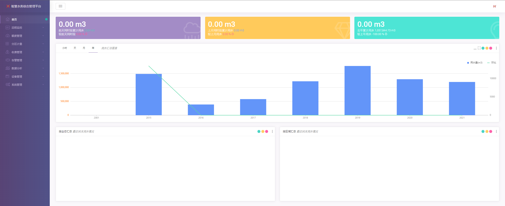
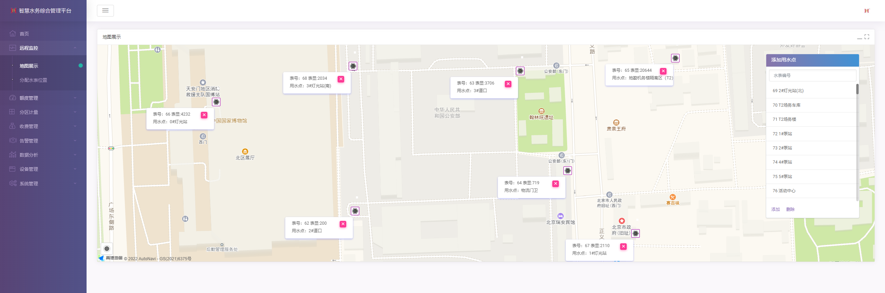
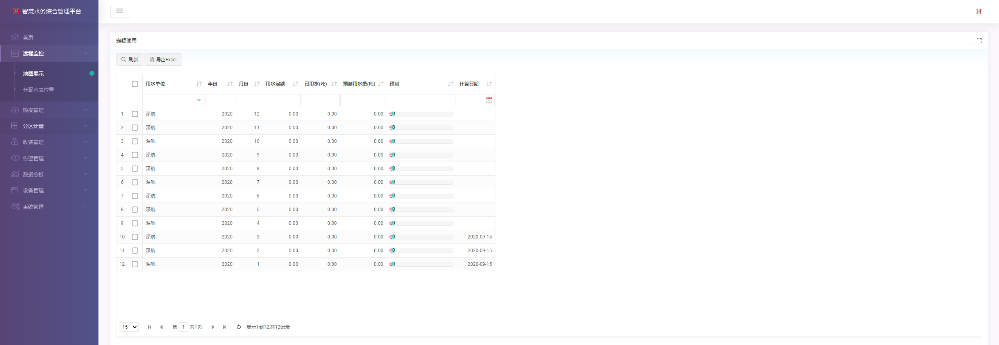
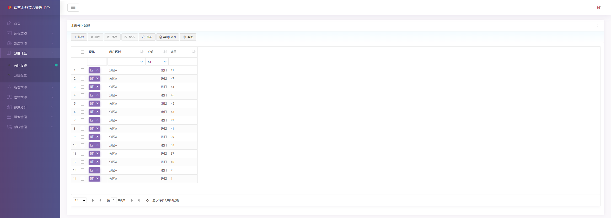
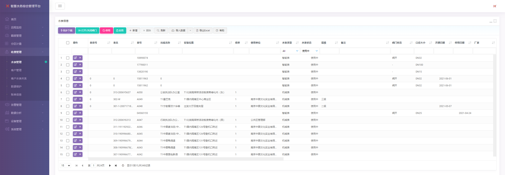
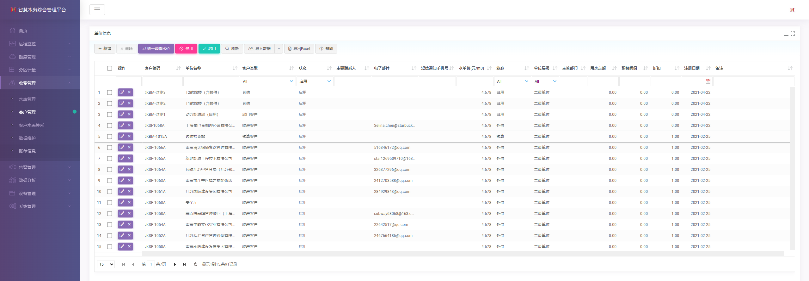
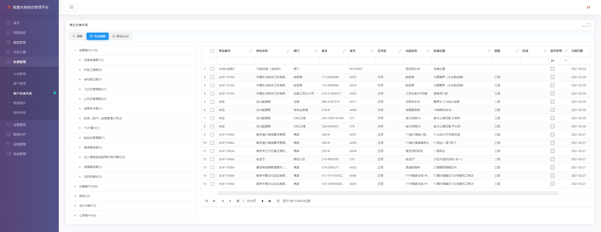
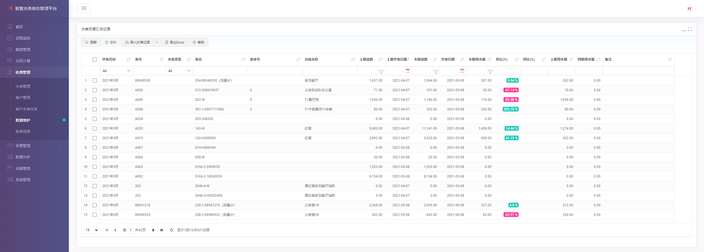
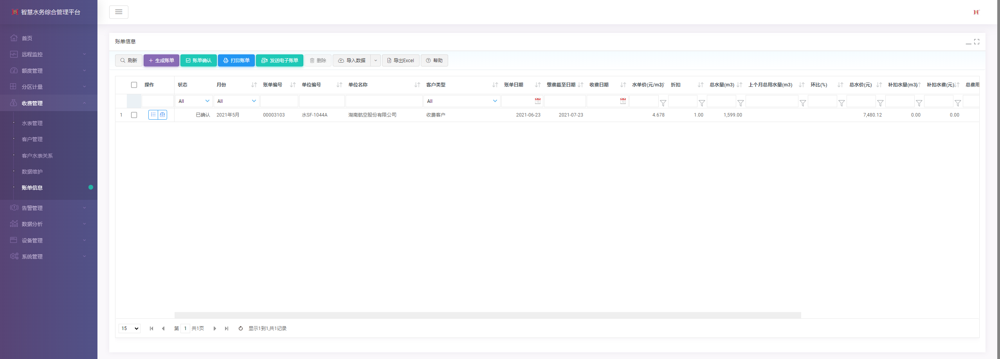
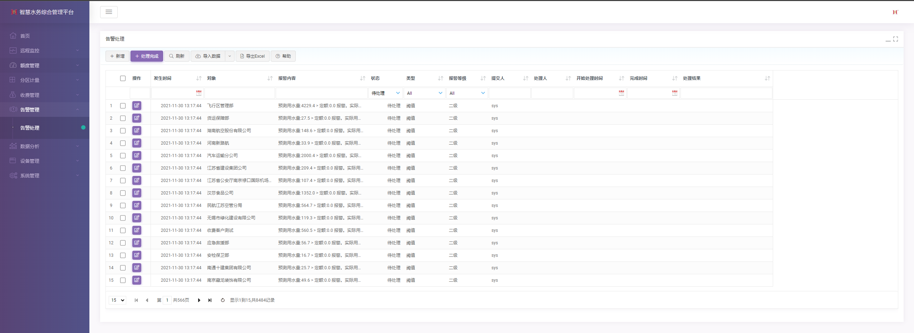
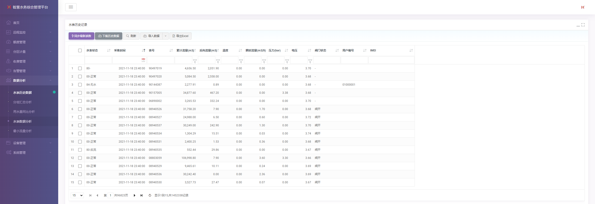
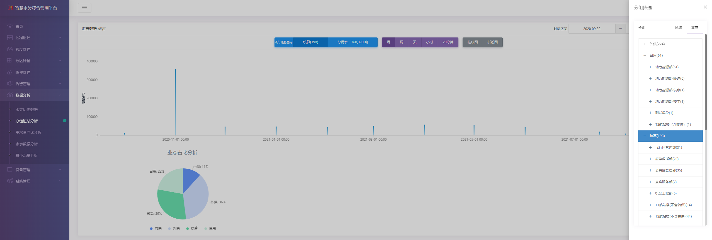
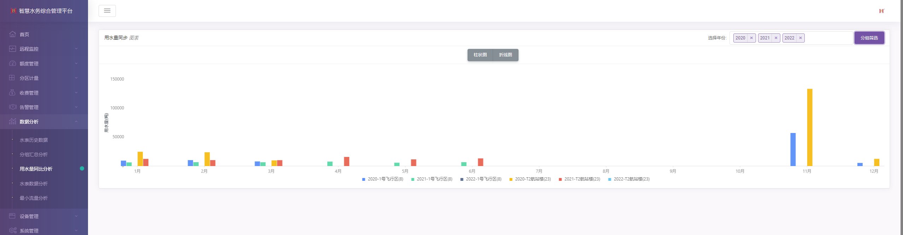
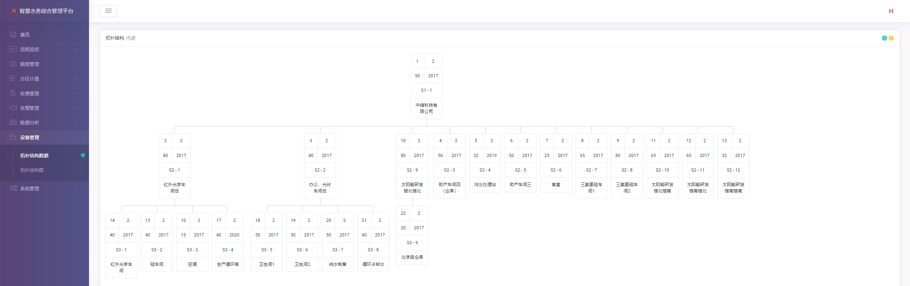

## 软件架构
ASP.Net MVC 5
Entity framework 6
SQL server 2016

#### 部署环境

1.  Windows Server 2012
2.  .net framework 4.8
3.  SQL Server 2012

